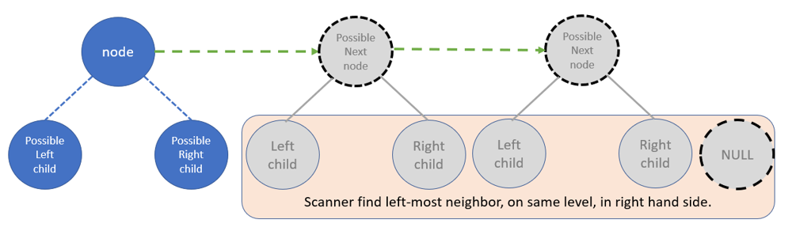
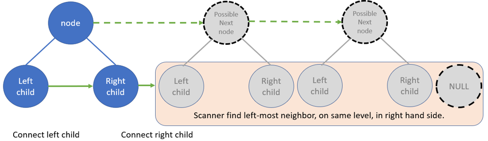
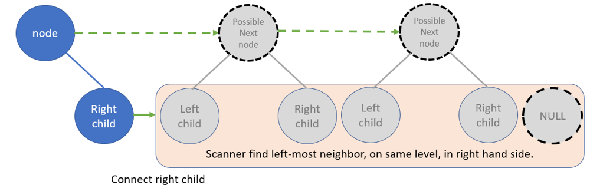
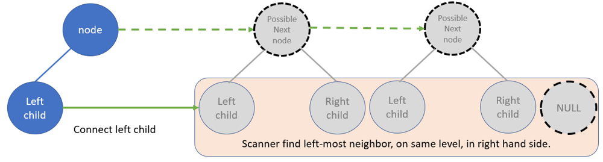

# LeetCode - Problem 117 - Populating Next Right Pointers in Each Node II

## PYTHON SOLUTION EXPLANATION:

Python O(1) aux space by DFS

### Hint

Think of pre-order traversal in DFS.

#### Algorithm:

For each current node,

Step_#1:
Update left child's next as right child.

Step_#2:
Update right child'next as left child of current's next **if the current's next exists**

Step_#3:
DFS down to next level with pre-order.

##### Abstract Model:

**Before** connection of next pointer:



----

**After** connection of next pointer:



----

Only right child exists



----

Only left child exists



----

##### Implementation:

```python
class Solution:
    def connect(self, root: 'Node') -> 'Node':
        
        def helper( node: 'Node'):
                
            scanner = node.next

            # Scanner finds left-most neighbor, on same level, in right hand side
            while scanner:

                if scanner.left:
                    scanner = scanner.left
                    break

                if scanner.right:
                    scanner = scanner.right
                    break

                scanner = scanner.next


            # connect right child if right child exists
            if node.right:
                node.right.next = scanner 

            # connect left child if left child exists
            if node.left:
                node.left.next = node.right if node.right else scanner


            # DFS down to next level
            if node.right:
                helper( node.right )

            if node.left:
                helper( node.left )
                
            return node
        # -------------------------------
        
        if not root:
            return None
        
        else:
            return helper( root ) 
```

----

Related leetcode challenge:

( a special case of current challenge )

[Leetcode - Problem 116 - Populating Next Right Pointers in Each Node](https://leetcode.com/problems/populating-next-right-pointers-in-each-node/)

[Refer to Python Solution](../008_leetcode_P_116_PopulatingNextRightPointersInEachNode/Solution.py)