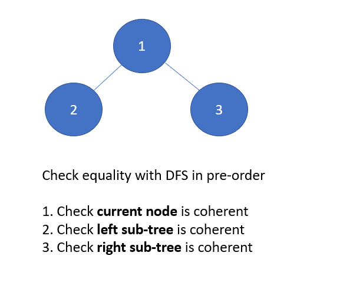

# LeetCode - Problem 100 - Same Tree

## PYTHON SOLUTION EXPLANATION:

Python O(n) sol by pre-order traversal

Diagram and Abstract Model:



----

Implementation by DFS with pre-order traversal:

```
# Definition for a binary tree node.
# class TreeNode:
#     def __init__(self, x):
#         self.val = x
#         self.left = None
#         self.right = None

class Solution:
    def isSameTree(self, p: TreeNode, q: TreeNode) -> bool:
        
        if p and q:
            # both p and q exist
            return (p.val == q.val) and self.isSameTree( p.left, q.left) and self.isSameTree( p.right, q.right )
        
        elif not p and not q:
			# both p and q are empty node ( i.e., None )
            return True
        
        else:
			# either p or q is empty, the other is non-empty.
            return False
```

Another Implementation by BFS :

```
from collections import deque

class Solution:
    def isSameTree(self, p: TreeNode, q: TreeNode) -> bool:

        def bfs( node: TreeNode ):
            
            cur_queue = [ node ] if node else [ None ]

            while cur_queue:
                
                next_queue = []
                
                for cur_node in cur_queue:
                    
                    if cur_node:
                        
                        yield cur_node.val
                        
                        next_queue.append( cur_node.left )
                        next_queue.append( cur_node.right )
                        
                    else:
                        yield None
            
                cur_queue = next_queue
            
        # -----------------------------------------------------
        
        iterator_p =  bfs( p ) 
        iterator_q =  bfs( q ) 
        
        while True:
            try:
                if next(iterator_p) != next(iterator_q):
                    return False
            except StopIteration:
                break
        
        return True
```

Related leetcode challenge:

Leetcode #101 Symmetric Tree

Leetcode #144 Binary Tree Preorder Traversal

Reference:

Wiki: Pre-order traversal of binary tree

----

Related leetcode challenge:

[Leetcode - Problem 101 - Symmetric Tree](https://leetcode.com/problems/symmetric-tree/)
[Leetcode - Problem 144 - Binary Tree Preorder Traversal](https://leetcode.com/problems/binary-tree-preorder-traversal)

----

Reference:

[Wiki: Pre-order traversal of binary tree](https://en.wikipedia.org/wiki/Tree_traversal#Pre-order_(NLR))