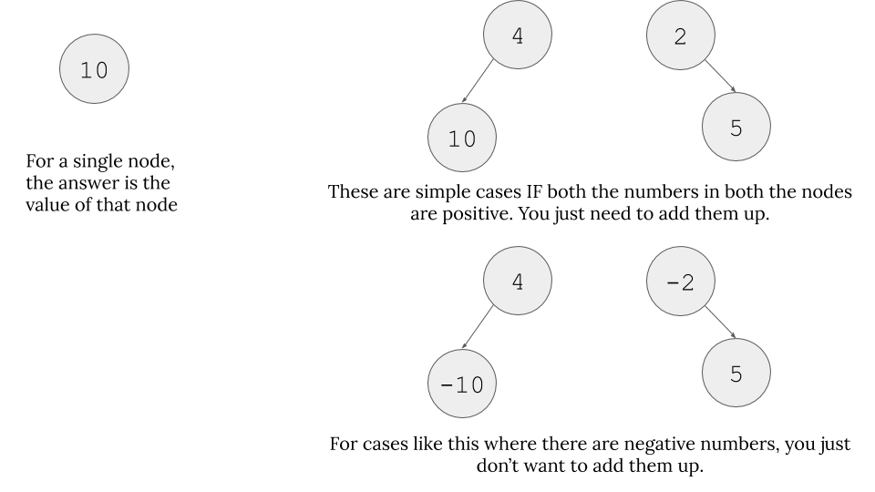
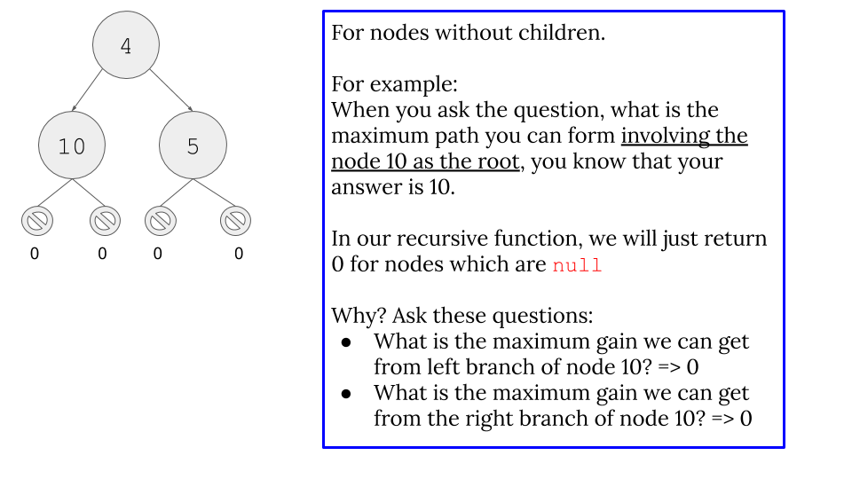
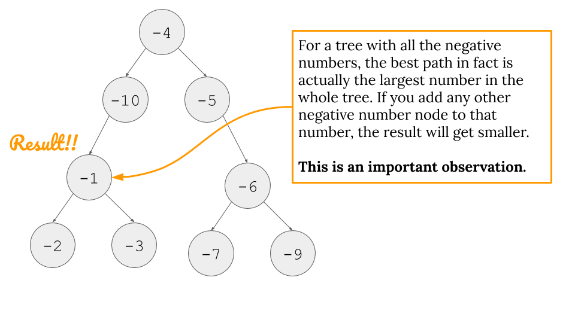
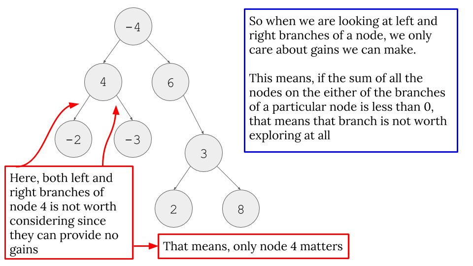
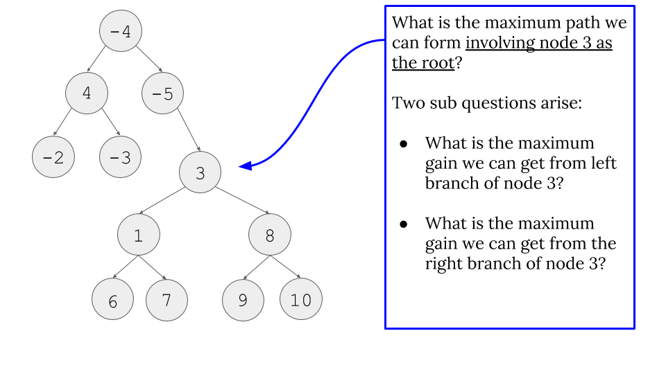
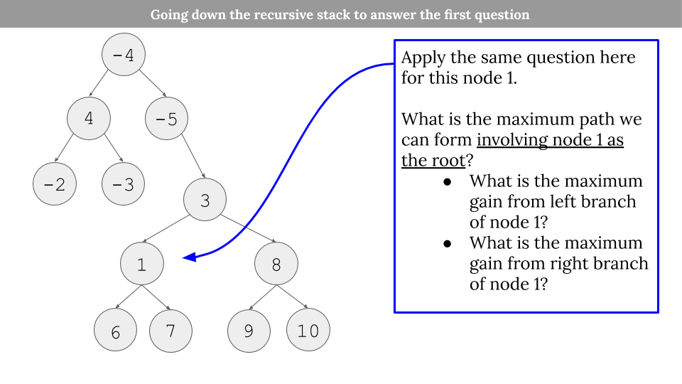
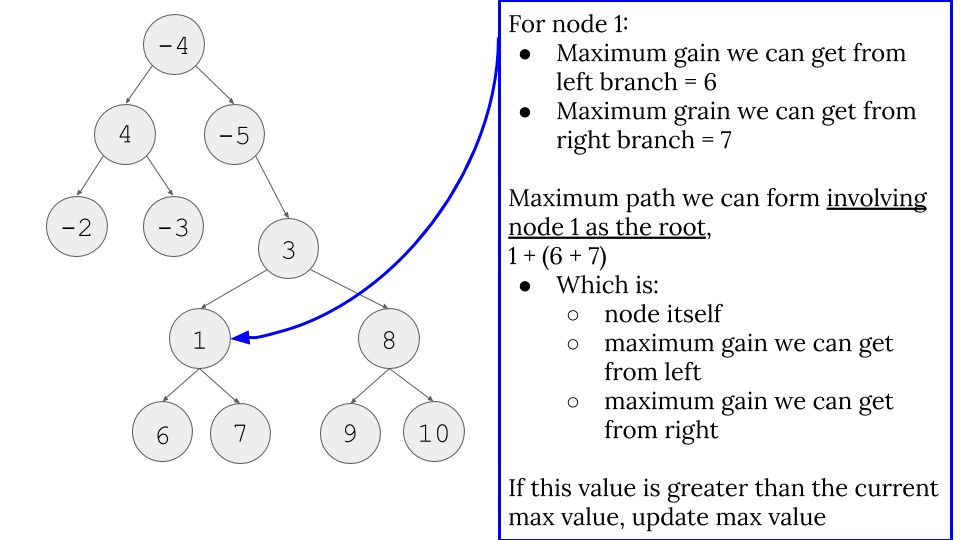
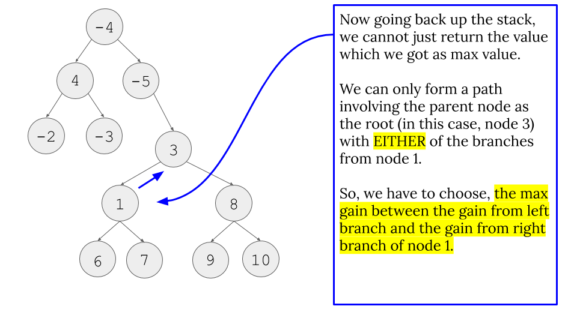

# LeetCode - Problem 124 - Binary Tree Maximum Path Sum

## PYTHON SOLUTION EXPLANATION:

This problem requires quite a bit of quirky thinking steps. Take it slow until you fully grasp it.

##### Basics



##### Base Cases



##### Important Observations

- These important observations are very important to understand `Line 9` and `Line 10` in the code.
    - For example, in the code ( `Line 9` ), we do something like `max(get_max_gain(node.left), 0)`. The important part is: why do we take maximum value between 0 and maximum gain we can get from left branch? Why 0 ?
    - Check the two images below first.



- The important thing is "We can only get any sort of gain IF our branches are not below zero. If they are below zero, why do we even bother considering them? Just pick 0 in that case. Therefore, we do `max(<some gain we might get or not>, 0)`.

##### Going down the recursion stack for one example



- Because of this, we do `Line 12` and `Line 13`. It is important to understand the different between looking for the maximum path INVOLVING the current node in process and what we return for the node which starts the recursion stack. `Line 12` and `Line 13` takes care of the former issue and `Line 15` (and the image below) takes care of the latter issue.

- Because of this fact, we have to return like `Line 15`. For our example, for node 1, which is the recursion call that node 3 does for `max(get_max_gain(node.left), 0)`, node 1 cannot include both node 6 and node 7 for a path to include node 3. Therefore, we can only pick the max gain from left path or right path of node 1.

##### Python
```
1. class Solution:
2.     def maxPathSum(self, root: TreeNode) -> int:
3. 		max_path = float("-inf") # placeholder to be updated
4. 		def get_max_gain(node):
5. 			nonlocal max_path # This tells that max_path is not a local variable
6. 			if node is None:
7. 				return 0
8. 				
9. 			gain_on_left = max(get_max_gain(node.left), 0) # Read the part important observations
10. 		gain_on_right = max(get_max_gain(node.right), 0)  # Read the part important observations
11. 			
12. 		current_max_path = node.val + gain_on_left + gain_on_right # Read first three images of going down the recursion stack
13. 		max_path = max(max_path, current_max_path) # Read first three images of going down the recursion stack
14. 			
15. 		return node.val + max(gain_on_left, gain_on_right) # Read the last image of going down the recursion stack
16. 			
17. 			
18. 	get_max_gain(root) # Starts the recursion chain
19. 	return max_path
```

----

Related leetcode challenge:

[Leetcode - Problem 687 - Longest Univalue Path](https://leetcode.com/problems/longest-univalue-path/)
[Leetcode - Problem 543 - Diameter of Binary Tree](https://leetcode.com/problems/diameter-of-binary-tree/)

----

Reference:

[Wiki: Pre-order traversal of binary tree](https://en.wikipedia.org/wiki/Tree_traversal#Pre-order_(NLR))