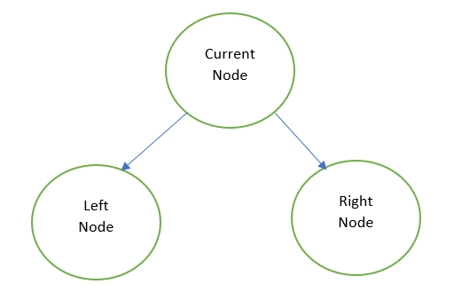
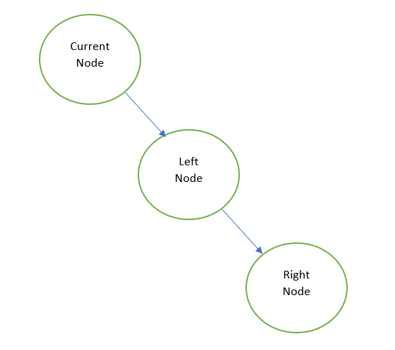

## LeetCode - Problem - 114: Flatten Binary Tree to Linked List

### Python O( n ) sol. by DFS approach.

### Goal:
**Convert binary tree** into a **right-skewed linked list**.

### Algorithm:
Maintain a global node, called **previous traversal node**, initialized to None, and update as current node on each DFS traversal.

DFS traversal with the ordering: ( Right node, Left node, Current node )

1. Change current node's **right child** as **previous traversal node**.
1. Change current node's **left child** as **None**(i.e., NULL)
1. **Update previous traversal node** as current node

### Observation:
For Left node, Right node is its previous traversal node.
For Current node, Left node is its previous traversal node.
_____

### Abstract Model:

Before flatten operation: ( binary tree )



After flatten operation: ( right-skewed linked list )


For Current node, Left node is its previous traversal node.
_____

### Implementation:

```python
# Definition for a binary tree node.
# class TreeNode:
#     def __init__(self, x):
#         self.val = x
#         self.left = None
#         self.right = None

class Solution:
      
    def flatten(self, root: TreeNode) -> None:
        """
        Input: root node of binary tree
        Output: convert binary tree to right-skewed linked list
        """
        
        # record of node of previous traversal
        previous_traversal = None
        
        def helper( node):
        
            if node:

                # DFS travesal to next level
                
                helper( node.right )
                helper( node.left )

                # flattern binary tree to right skewed linked list
                
                nonlocal previous_traversal
                node.right = previous_traversal
                node.left = None
                previous_traversal = node
                
        # ---------------------
        
        helper(root)
```

