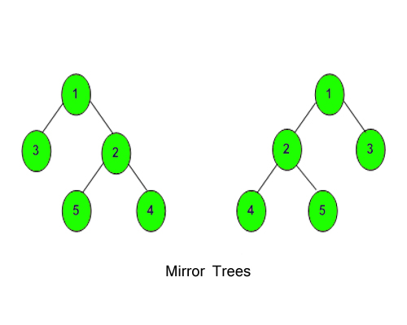

# GeeksForGeeks - Mirror Tree

## Problem Description:

Given a Binary Tree, convert it into its mirror.



### **Example 1:**

```
Input:
      1
    /  \
   2    3
Output: 2 1 3
Explanation: The tree is
   1    (mirror)  1
 /  \    =>      /  \
3    2          2    3
The inorder of mirror is 2 1 3
```

### **Example 2:**

```
Input: n = 0
Output: 0
```
### Example 2:

```
Input:
      10
     /  \
    20   30
   /  \
  40  60
Output: 30 10 60 20 40
Explanation: The tree is
      10               10
    /    \  (mirror) /    \
   20    30    =>   30    20
  /  \                   /   \
 40  60                 60   40
The inroder traversal of mirror is
30 10 60 20 40.
```

### **Your Task:**

Just complete the **function mirror()** that takes **node** as a **parameter** and 
convert it into its mirror. The printing is done by the driver code only.

**Expected Time Complexity:** `O(N)`.

**Expected Auxiliary Space:** `O(Height of the Tree)`.

### **Constraints:**
* `1 <= Number of nodes <= 100`
* `1 <= Data of a node <= 1000`