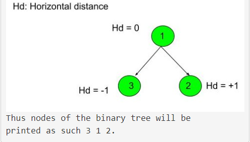

# Geeks for Geeks - Bottom View of Binary Tree

## **Problem Description:**

Given a binary tree, print the bottom view from left to right.
A node is included in bottom view if it can be seen when we look at the tree from bottom.

                      20
                    /    \
                  8       22
                /   \        \
              5      3       25
                    /   \      
                  10    14

For the above tree, the bottom view is 5 10 3 14 25.
If there are multiple bottom-most nodes for a horizontal distance from root, then print the later one in level traversal. For example, in the below diagram, 3 and 4 are both the bottommost nodes at horizontal distance 0, we need to print 4.

                      20
                    /    \
                  8       22
                /   \     /   \
              5      3 4     25
                     /    \      
                 10       14

For the above tree the output should be 5 10 4 14 25.

## **Examples:**

**Example 1:**

```
Input:
       1
     /   \
    3     2

Output: 3 1 2

Explanation:
First case represents a tree with 3 nodes
and 2 edges where root is 1, left child of
1 is 3 and right child of 1 is 2.
```


**Example 2:**

```
Input:
         10
       /    \
      20    30
     /  \
    40   60
    
Output: 40 20 60 30
```

## **Your Task:**
This is a functional problem, you don't need to care about input, 
just complete the function bottomView() which takes the root node 
of the tree as input and returns an array containing 
the bottom view of the given tree.

* **Expected Time Complexity**: `O(N)`.
* **Expected Auxiliary Space**: `O(N)`.

## **Constraints:**
1 <= Number of nodes <= 10^5
1 <= Data of a node <= 10^5