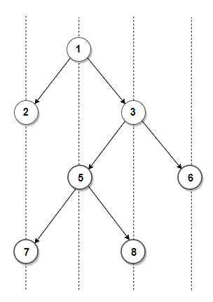
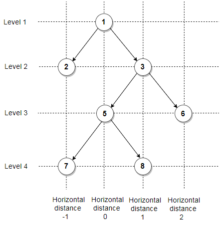

# Geeks for Geeks - Bottom View of Binary Tree

Given an binary tree, print bottom view of binary tree. Assume, the left and right child of a node makes 45 degree angle with the parent.

For example, Bottom view of below tree is `7, 5, 8, 6`



This problem can be easily solved with the help of [Hashing](https://www.techiedelight.com/hashing-in-data-structure/). 
The idea is to create an empty map where each key represents the relative horizontal distance of the node 
from the root node and value in the map maintains a pair containing node&#8217;s value and its level number. 
Then we do a pre-order traversal of the tree and if current level of a node is more than 
or equal to maximum level seen so far for the same horizontal distance as current node's 
or current horizontal distance is seen for the first time, we update the value and the level 
for current horizontal distance in the map. For each node, we recur for its left subtree 
by decreasing horizontal distance and increasing level by 1 and recur for right subtree 
by increasing both level and horizontal distance by 1.

Below figure shows horizontal distance and level of each node in above binary tree. The final values in the map will be

```
(horizontal distance -> (node's value, node's level))
-1 -> (7, 4)
0 -> (5, 3)
1 -> (8, 4)
2 -> (6, 3)
```



```python
# Data structure to store a Binary Tree node
class Node:
    def __init__(self, key=None, left=None, right=None):
        self.key = key
        self.left = left
        self.right = right
 
 
# Recursive function to do a pre-order traversal of the tree and fill the dictionary
# Here node has 'dist' horizontal distance from the root of the
# tree and level represent level of the node
def printBottom(root, dist, level, dict):
 
    # base case: empty tree
    if root is None:
        return
 
    # if current level is more than or equal to maximum level seen so far
    # for the same horizontal distance or horizontal distance is seen for
    # the first time, update the dictionary
    if dist not in dict or level >= dict[dist][1]:
        # update value and level for current distance
        dict[dist] = (root.key, level)
 
    # recur for left subtree by decreasing horizontal distance and
    # increasing level by 1
    printBottom(root.left, dist - 1, level + 1, dict)
 
    # recur for right subtree by increasing both level and
    # horizontal distance by 1
    printBottom(root.right, dist + 1, level + 1, dict)
 
 
# Function to print the bottom view of given binary tree
def printBottomView(root):
 
    # create a dictionary where
    # key -> relative horizontal distance of the node from root node and
    # value -> pair containing node's value and its level
    dict = {}
 
    # do pre-order traversal of the tree and fill the dictionary
    printBottom(root, 0, 0, dict)
 
    # traverse the dictionary in sorted order of their keys and
    # print the bottom view
    for key in sorted(dict.keys()):
        print(dict.get(key)[0], end=' ')
 
 
if __name__ == '__main__':
 
    root = Node(1)
    root.left = Node(2)
    root.right = Node(3)
    root.left.right = Node(4)
    root.right.left = Node(5)
    root.right.right = Node(6)
    root.right.left.left = Node(7)
    root.right.left.right = Node(8)
 
    printBottomView(root)
```
**Output:**
```
7 5 8 6
```

The time complexity of the above solution is `O(nlog(n))` and the
auxiliary space used by the program is `O(n)`.
